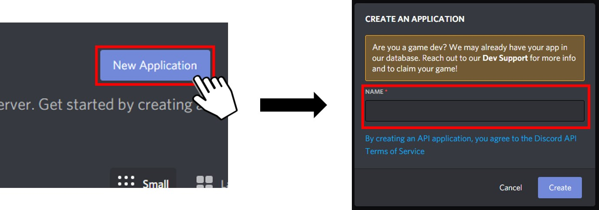
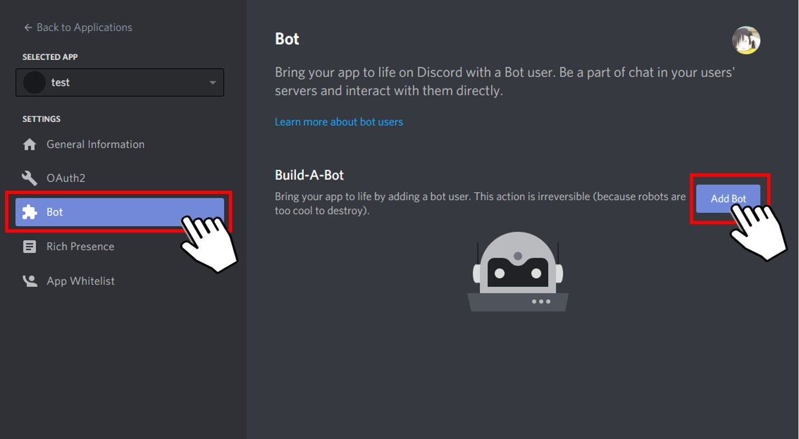
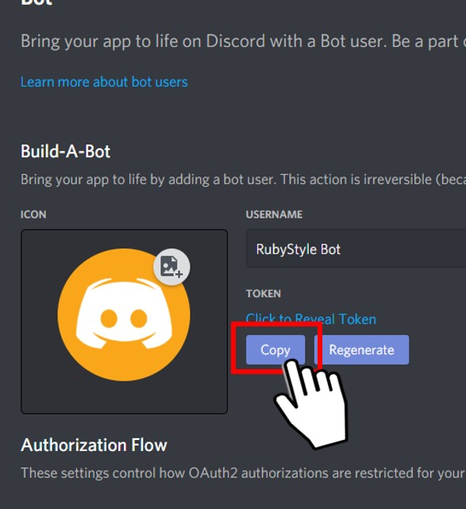
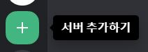
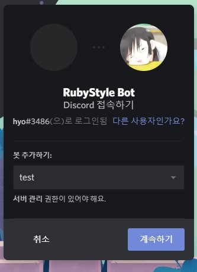

# 3on3freestyle_bot Project
## 1. What is it?
This project is a bot that reports user game history of PlayStation 4 online game 3on3 FreeStyle using the Discord bot api.
The site used to request game records is as follows. 
<http://3on3rank.fsgames.com/>  
This project was developed using python3 in the ubuntu linux environment. 
You need to be subscribed to Discord to run this project. 
Detailed information required for the development of Discord Bot can be found in the official document. 
<https://discord.com/developers/docs/intro/> 
* * *
## 2. Git Repository Download
<pre><code>git clone https://github.com/leekanghyo/3on3freestyle_bot.git</code></pre>
* * *
## 3. Install required packages
<pre>
<code>
$sudo apt-get install python3
$sudo apt-get install python3-pip

$pip3 install discord
$pip3 install tabulate
</code>
</pre>
* * *
## 4. Project structure
<pre>
<code>
.
├── README.md
├── bot_3on3freestyle.py
├── constants.py
└── controller
    ├── userController.py
    ├── crewController.py
    └── commonController.py
</code>
</pre>
- constants.py: Manages TOKEN, api, and necessary constant information.
- bot_3on3freestyle.py: Load the bot. This is a file to wait for user commands and parse information on the screen.
- userController.py: This file is processed when bot_3on3freestyle.py is requested for information about user.
- crewController.py: This file is processed when bot_3on3freestyle.py is requested for information about crew.
- commonController.py: This file is to receive the necessary parameters, finally request the result, and return it to the user.
* * *
## 5. Create bot and get token
Access the site below.   
<https://discord.com/developers/applications/>  
</img> 
Click the New Application button at the top right of the page to create an application with an appropriate name.  
</img> 
Click the Bot item in the menu and then click the AddBot button to create a Bot with an appropriate name.  
</img> 
Click the Copy button of the TOKEN item to copy the TOKEN, then paste it into the TOKEN variable of constants.py in the Python project.  
</img> 
In the Discord client, add an appropriately named test server.  
</img> 
Return to the browser and click on the General Information item in the menu. 
Copy the CLIENT ID, paste it into the client_id parameter at the address below, and load the page. 
<pre><code>
https://discord.com/oauth2/authorize?client_id=[Your Client ID]&scope=bot&permissions=8
</pre></code>
  
</img> 
Select the server you just created from the server list and complete the connection approval process.  
Now return to the project and run the Bot with the command below.
<pre><code>
python3 bot_3on3freestyle.py
</pre></code>
 
</img> 

If you connect to the test server from the Discord client, you can check that the bot is connected. 
Enter the [!help] command to bring up the command list. 
